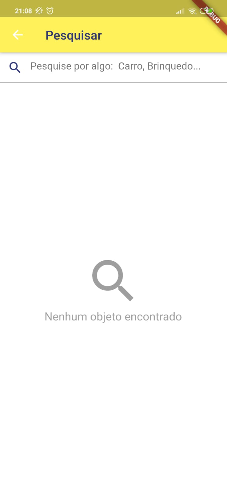
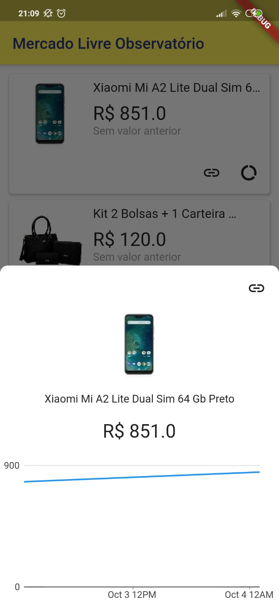

# Mercado Livre Observable

## How this works

I created a [api](https://github.com/raphaelkieling/mercado-livre-observable) to search and save mercado livre products on a mongo database.

Every 5 minutes the api gonna get all save products and will track value changes and put in `price_history` to populate chart on mobile.

## Prints

    
    
    
    

